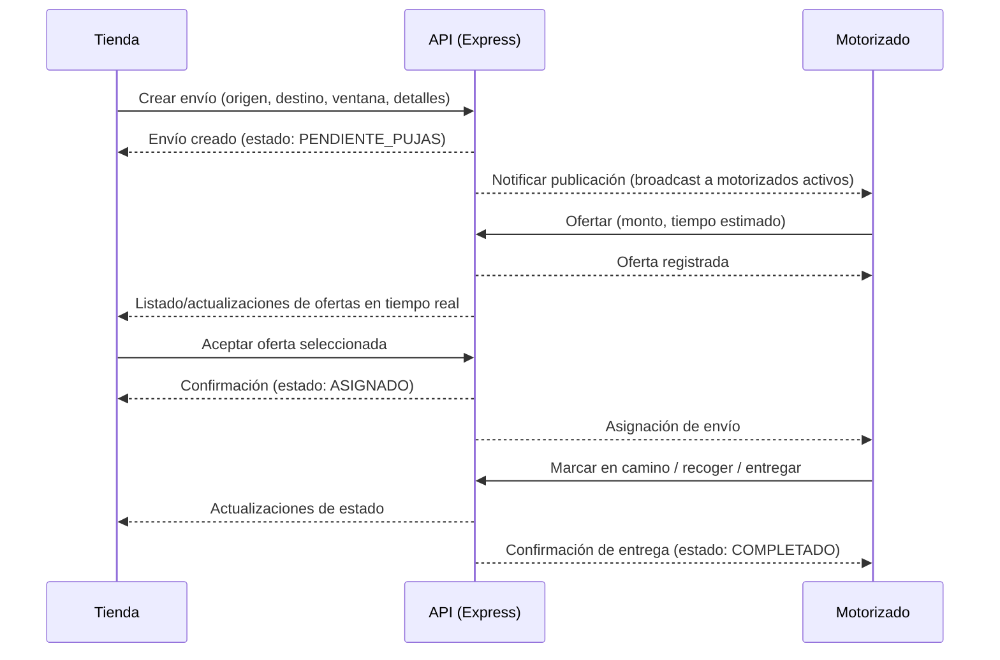

# Arquitectura de FLIPY

## Diagrama de Arquitectura
```mermaid
graph LR
  subgraph Cliente
    A[Web App (Next.js)]
    B[App Tienda (React Native)]
    C[App Motorizado (React Native)]
  end

  subgraph Backend
    D[API REST - Node.js/Express]
  end

  subgraph Infra
    E[(PostgreSQL)]
    F[(Cache/Cola - futuro: Redis/RabbitMQ)]
  end

  A -->|HTTP/HTTPS| D
  B -->|HTTP/HTTPS| D
  C -->|HTTP/HTTPS| D
  D -->|SQL| E
  D <-->|Eventos/Jobs| F
```

## Flujo de Usuarios


Estados principales del envío: `BORRADOR` → `PENDIENTE_PUJAS` → `ASIGNADO` → `EN_CURSO` → `ENTREGADO`/`CANCELADO`.

## Tecnologías y Justificación
- Node.js + Express: **Simplicidad**, ecosistema maduro, rápida iteración para APIs REST.
- Next.js: **SSR/SSG**, optimización para SEO, DX sobresaliente para paneles y front de tienda.
- React Native: **Código compartido** entre iOS/Android, velocidad de desarrollo.
- PostgreSQL: **Relacional** y robusto, soporte para transacciones y consultas complejas.
- Cache/Cola (futuro, p. ej. Redis/RabbitMQ): **Tiempo real** y procesamiento asíncrono (notificaciones, subastas, geolocalización, pricing).

## Consideraciones de Diseño
- Autenticación basada en JWT para apps y sesiones para web si se requiere.
- Autorización por roles: `tienda`, `motorizado`, `admin`.
- Modelo de pujas: ofertas con monto, ETA y ventana de validez; selección manual o automática según reglas.
- Observabilidad: logs estructurados, métricas, tracing (a definir en fases siguientes).
- Escalabilidad: separación de servicios futura (microservicios/event-driven) si el volumen lo exige.


